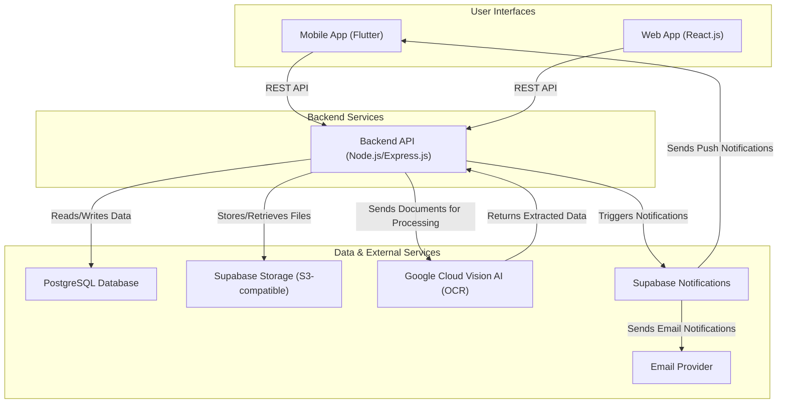
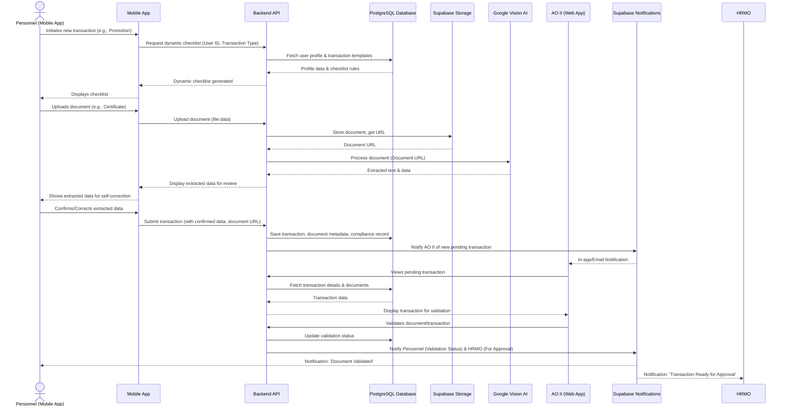

# ARCHITECTURE.md: Eminence HRIS

## System Overview

The Eminence HRIS employs a modern, cloud-native, and microservices-oriented architecture designed for scalability, resilience, and maintainability. It consists of distinct frontend applications (mobile and web) communicating with a centralized backend API. This API orchestrates interactions with a robust PostgreSQL database, object storage for documents, and specialized external services for OCR processing and real-time notifications, ensuring efficient digital personnel record management and streamlined HR workflows.

## High-Level Architecture Diagram

## Component Breakdown

### Mobile App (Flutter)
The mobile application, built with Flutter, serves as the primary interface for Teaching and Non-Teaching Personnel. It handles user authentication, profile management, transaction initiation, dynamic checklist generation, document uploads (with OCR self-correction), real-time status tracking, and displays career records and notifications. It communicates with the Backend API via RESTful endpoints.

### Web App (React.js)
The web application, built with React.js, provides administrative functionalities for System Administrators, AO II, HRMO Personnel, and Records Personnel. It features dashboards, personnel management, document validation workflows, transaction approval, configurable promotion management, digital 201 repository access, reporting, and audit trail viewing. It interacts with the Backend API via RESTful endpoints.

### Backend API (Node.js/Express.js)
The Backend API, developed using Node.js with Express.js, acts as the central brain of the system. It exposes RESTful APIs for both mobile and web clients, handles business logic, user authentication (JWT), authorization (RBAC), data validation, and orchestrates interactions with the database, file storage, OCR service, and notification service. It is responsible for processing transactions, managing promotion rules, and maintaining audit logs.

### PostgreSQL Database
PostgreSQL is the relational database management system used to store all structured data for Eminence HRIS. This includes user accounts, personnel profiles, transaction details, requirement templates, compliance records, validation logs, notification history, promotion applications, plantilla information, rankings, career history, and metadata for archived documents. Its support for JSONB and advanced querying capabilities is leveraged for flexible data structures and efficient data retrieval.

### Supabase Storage (S3-compatible)
Supabase Storage provides secure, scalable object storage for all uploaded documents and digital 201 files. It offers fine-grained access control and integrates seamlessly with the Backend API for storing and retrieving files, ensuring data integrity and availability.

### Google Cloud Vision AI (OCR)
Google Cloud Vision AI is an external service utilized for Optical Character Recognition (OCR). The Backend API sends uploaded document images to this service for text extraction and data parsing, which is crucial for automating compliance checks and assisting in document validation workflows.

### Supabase Notifications
Supabase Notifications is an external service used for managing and sending real-time notifications. The Backend API triggers notifications through this service for various events, such as transaction status changes, document deficiencies, and approvals. It supports both in-app push notifications (to the mobile app) and can integrate with an email provider for email notifications.

### Email Provider
An external email service (e.g., SendGrid, AWS SES) is integrated via Supabase Notifications or directly by the Backend API to send email notifications to users for critical updates and alerts, complementing in-app notifications.

## Critical Flow Sequence Diagram: Personnel Submits Transaction

This sequence diagram illustrates the core flow of a personnel submitting a transaction, including document upload, OCR processing, self-correction, and initial validation by AO II.

## Deployment Strategy

The Eminence HRIS components are deployed across a combination of cloud services to ensure high availability, scalability, and security.

*   **Mobile App (Flutter):** The compiled Android and iOS applications are deployed to the respective app stores (Google Play Store and Apple App Store). Updates are managed through standard app store release processes.
*   **Web App (React.js):** The static web application files are hosted on Amazon S3 and distributed globally via Amazon CloudFront for low-latency access.
*   **Backend API (Node.js/Express.js):** The Backend API is deployed as containerized services on AWS Fargate, managed by Amazon ECS. This provides automatic scaling, load balancing via an Application Load Balancer (ALB), and high availability across multiple Availability Zones.
*   **PostgreSQL Database:** Hosted on Amazon RDS for PostgreSQL, providing managed database services including automated backups, patching, and scaling capabilities.
*   **Supabase Storage:** Leverages Supabase's managed object storage solution, which is built on top of AWS S3, ensuring robust and scalable file storage.
*   **Google Cloud Vision AI:** This is a fully managed external SaaS offering by Google Cloud, accessed via API calls from the Backend API.
*   **Supabase Notifications:** This is a fully managed external SaaS offering by Supabase, accessed via API calls from the Backend API.
*   **Email Provider:** An external email service (e.g., AWS SES or SendGrid) is integrated with the Backend API or Supabase Notifications for sending transactional emails.